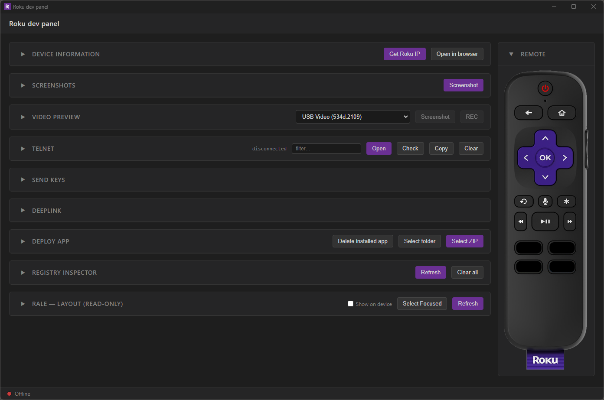

# Roku dev panel

Electron desktop app for controlling a Roku device during development. Wraps the ECP (External Control Protocol) and sideload server endpoints in a single UI.



## Features

- **Device info** — LAN discovery, ping, live model/software version, open the dev web UI, reboot, check for updates.
- **Screenshots** — Capture via the sideload server, saved to `screenshots/` with a thumbnail strip.
- **Capture** — Pull a USB capture card / webcam stream into the panel; on-demand screenshots and video recording.
- **Deploy** — Sideload a ZIP or folder, one-click redeploy from recents, and delete the installed app.
- **Telnet** — Stream the debug console (port 8085) with colorized output, foldable backtraces/JSON, substring filter, and copy.
- **Send keys** — Send a saved user's username/password or run the full sign-in sequence.
- **Deeplink** — Multiple collapsible parameter sets, each with **Send Launch** / **Send Input**; last-used button is remembered.
- **Registry inspector** — Read/edit/add/delete the dev channel's `roRegistry` over the RALE TrackerTask (no device keying needed).
- **RALE Layout (read-only)** — Browse the running channel's SceneGraph tree and node details, with a bounding-box mini-map.
- **Remote** — On-screen remote with clickable buttons that send ECP keypresses.
- **Layout** — Drag cards to reorder; order and collapsed state persist.

## Install

```bash
npm install
```

## Run

```bash
npm run dev      # electronmon — hot-reloads on file changes
# or
npm start        # plain electron
```

First launch reads `config.json`. If `deviceHost` is empty, click **Get Roku IP** to discover and write it.

## Configuration

`config.json` lives at the project root. You normally only set `deviceHost` and `deviceCredentials` by hand — everything else is managed by the UI.

```json
{
  "version": 1,
  "deviceHost": "192.168.1.100",
  "deviceCredentials": {
    "username": "rokudev",
    "password": "<dev mode password>"
  }
}
```

`deviceCredentials.password` is required for Screenshot, Open in browser, and Deploy (HTTP Digest auth on port 80).
